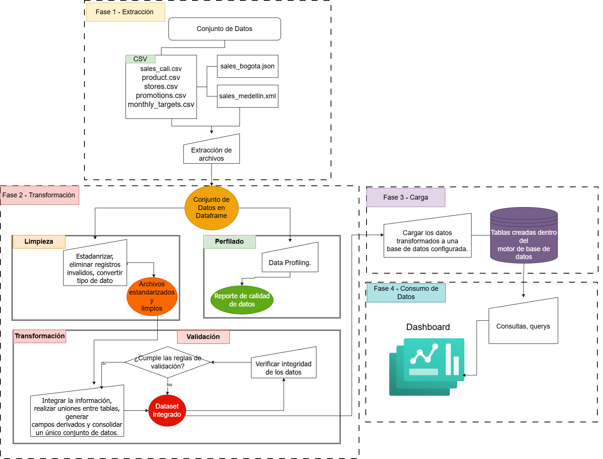

# Retail Analytics ETL Pipeline

## 1. Project Overview

This project implements an **Extract, Transform, and Load (ETL)** pipeline for a retail analytics platform. The pipeline processes transactional and reference data from heterogeneous sources, including CSV, JSON, and XML files, to generate a consolidated analytical dataset for business intelligence.

The solution follows a modular ETL architecture that extracts, profiles, cleans, transforms, validates, and loads retail data into a relational database. The resulting dataset supports SQL queries, KPI calculation, and dashboard development for decision-making.

---

# 2. System Architecture

The ETL pipeline follows the architecture shown below.

<p align="center">
  
</p>

The pipeline consists of the following stages:

- Data Extraction
- Data Profiling
- Data Cleaning and Harmonization
- Data Transformation and Integration
- Data Validation
- Data Loading
- SQL Queries and Analytical Outputs

---

# 3. Selected Business Requirements

The first version of the analytical platform addresses the following business requirements.

| Business Requirement | Expected Analytical Output |
|----------------------|----------------------------|
| Visualize total sales of the company | Total Sales KPI |
| Analyze product category performance | Sales by category visualization |
| Compare sales performance across stores and regions | Dashboard with store and region filters |
| Analyze daily and monthly sales trends | Time-series charts |
| Monitor sales target achievement | Target compliance KPI |
| Generate downloadable reports for marketing | Exportable analytical reports |

---

# 4. ETL Pipeline Description

## Data Extraction

The extraction stage loads transactional and reference datasets from heterogeneous sources into Pandas DataFrames while preserving the original information.

**Input datasets**

- sales_cali.csv
- sales_bogota.json
- sales_medellin.xml
- products.csv
- stores.csv
- promotions.csv
- monthly_targets.csv

**Output**

- Dictionary of DataFrames.

---

## Data Profiling

The profiling stage evaluates the structure and quality of every dataset before any transformation is applied.

The analysis includes:

- Number of rows and columns
- Data types
- Missing values
- Duplicate records
- Invalid dates
- Invalid quantities
- Invalid prices
- Cardinality of selected categorical variables

**Outputs**

- Profiling reports
- EDA summary tables
- Data quality reports

---

## Data Cleaning and Harmonization

This stage standardizes the datasets and applies the data quality rules identified during profiling.

Implemented rules include:

- Standardize identifiers.
- Remove leading and trailing whitespace.
- Normalize text values.
- Convert dates into a common format.
- Convert quantity and unit price into numeric values.
- Remove duplicated records.
- Remove invalid dates.
- Remove records with quantity ≤ 0.
- Remove records with unit price ≤ 0.
- Standardize missing promotion codes.

**Output**

- Clean and standardized datasets.

---

## Data Transformation and Integration

The transformation stage combines the transactional datasets with the reference tables to generate a unified analytical dataset.

Main operations include:

- Merge sales datasets.
- Join product information.
- Join store information.
- Join promotion information.
- Join monthly sales targets.
- Calculate gross sales.
- Calculate discount amount.
- Calculate net sales.

**Output**

- Integrated analytical dataset (756 records × 25 attributes).

---

## Data Validation

Before loading, the integrated dataset is validated against business and data quality rules.

Validation includes:

- Unique sales identifiers.
- Referential integrity.
- Mandatory fields.
- Positive quantities and prices.
- Gross and net sales consistency.
- Promotion validity period.

Only datasets that satisfy all validation rules continue to the loading stage.

---

## Data Loading

The validated dataset is stored in two destinations:

- Processed CSV file (`data/processed/integrated_sales.csv`)
- SQLite database (`database/retail_analytics.db`)

The analytical table created in the database is named:

- `sales_analytics`

---

## Analytical Queries

The project implements six SQL queries corresponding to the prioritized business requirements.

The queries generate:

- KPI tables
- Sales trends
- Product category performance
- Store comparison
- Sales target achievement
- Exportable analytical reports

All analytical queries read data exclusively from the SQLite database.

---

# 5. Project Structure

```text
Retail-Analytics-Pipeline
│
├── data
│   ├── raw/
│   └── output/
│
├── database
│   └── retail_analytics.db
│
├── docs
│   ├── eda_outputs/
│   ├── query_outputs/
│   └── images/
    └── DATA_DICTIONARY.md
│
├── logs
│   └── etl_run.log
│
├── src
│    ├──dashboard
│      └── app.py
│      └── __init__.py
       └── launcher.py
│   ├── extract.py
│   ├── profile.py
│   ├── clean.py
│   ├── transform.py
│   ├── validate.py
│   ├── load.py
│   ├── queries.py
│   └── main.py
│
└── README.md
```

---

# 6. Execution Instructions

Clone the repository and execute the complete ETL pipeline from the project root.

```bash
python src/main.py
```

The execution performs the following stages sequentially:

1. Data Extraction
2. Data Profiling
3. Data Cleaning
4. Data Transformation
5. Data Validation
6. Data Loading
7. SQL Query Execution

The generated outputs include:

- Processed datasets
- SQLite database
- Profiling reports
- Summary tables
- Analytical query results
- Charts
- Execution log

---

# 7. Technologies Used

- Python 3
- Pandas
- NumPy
- SQLite
- Matplotlib
- streamlit

---
# 8. Example Analytical Results

After executing the ETL pipeline, the analytical database can be queried to obtain business insights such as:

- Total sales of the company.
- Sales performance by product category.
- Sales comparison by store and region.
- Daily and monthly sales trends.
- Sales target achievement by store.
- Exportable reports for marketing analysis.

The results are automatically generated as tables and visualizations in:

```text
docs/query_outputs/
├── tablas/
└── graficas/
```

These outputs provide the information required to support business decision-making.
